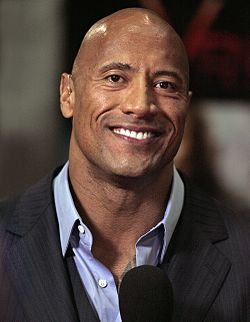
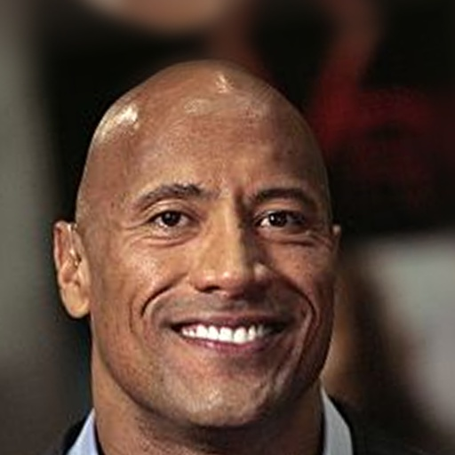
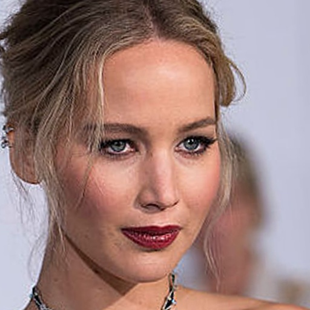
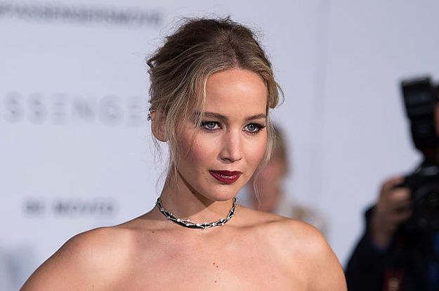
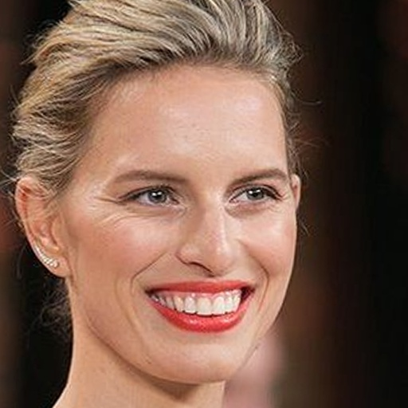
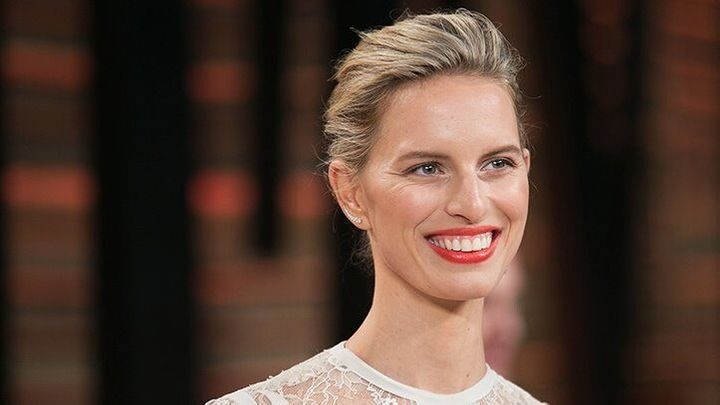
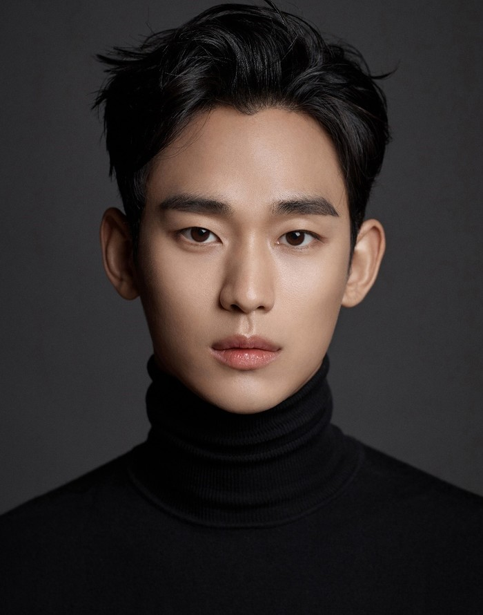
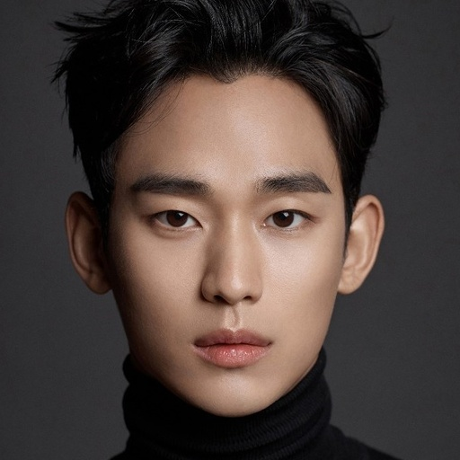
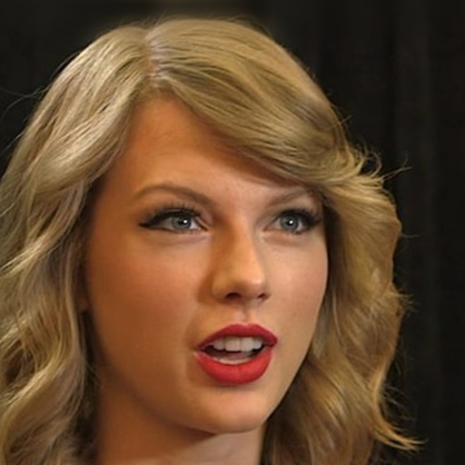
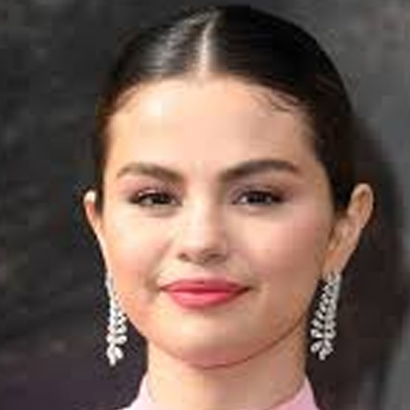

## FFHQ Face Alignment and Paste Back
#### This repo contains codes for performing face alignment in FFHQ style, along with the code which pastes back the aligned images back onto the original images. The latter function is surprisingly not readily available in most face alignment repos.
#### You are welcomed to use or redistribute the code for any purpose.
##


| original images | alignment images | pasted back | 
| --- | --- | --- |
|   |    |    |
|   |    |    |
|   |    |    |
|   |    |    |
|   |    |    |
|   |    |    |

---


**Example command for face alignment**
```
python face_align.py --src test_imgs --dst test_results --output_landmark_dir test_landmarks
```

**Example command for paste back**
```
python paste_back.py --aligned_imgs test_results --original_imgs test_imgs --dst test_pastebacks --landmark_dir test_landmarks
```

Reference
- [FFHQ Alignment](https://github.com/happy-jihye/FFHQ-Alignment/tree/master/FFHQ-Alignmnet) - The alignment logic comes from this repo. I rewrote the code in CV and wrote new paste back codes.